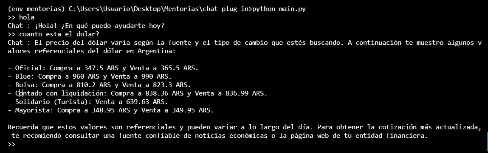

# Chatbot con plug_in del dolar

Este es un chatbot que utiliza la API de OpenAI para realizar consultas y obtener respuestas. El chatbot utiliza una memoria de 20 mensajes para mantener un contexto de la conversación.

## Requisitos

- Python 3.x
- OpenAI API key

## Instalación

1. Instalar las dependencias:
pip install openai
1. Configurar la API key de OpenAI:
Generando un archivo .env con la clave

## Uso

Ejecutar el archivo  `main.py`  para iniciar el chatbot:
python main.py

El chatbot solicitará al usuario que ingrese un mensaje. El usuario puede ingresar cualquier mensaje y el chatbot intentará responder con una respuesta relevante.

El chatbot también admite una función adicional como plug-in, que se puede activar ingresando un mensaje específico. En este caso, el chatbot ejecutará la función y devolverá la respuesta como parte de la conversación.

## Archivos

###  `main.py` 

Este archivo contiene el bucle principal del chatbot. El archivo utiliza la biblioteca  `collections.deque`  para mantener una memoria de los últimos 20 mensajes de conversación. También utiliza las funciones  `consulta_con_funcion` ,  `consulta`  y  `rol_content_func`  del archivo  `utils.py`  para realizar consultas y procesar las respuestas.

###  `utils.py` 

Este archivo contiene las funciones auxiliares necesarias para el chatbot. Incluye funciones para realizar consultas a la API de OpenAI, procesar las respuestas y obtener datos del valor del dólar.

